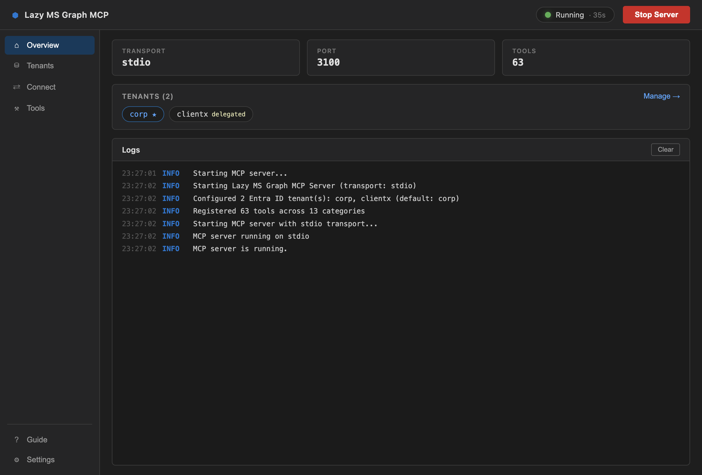
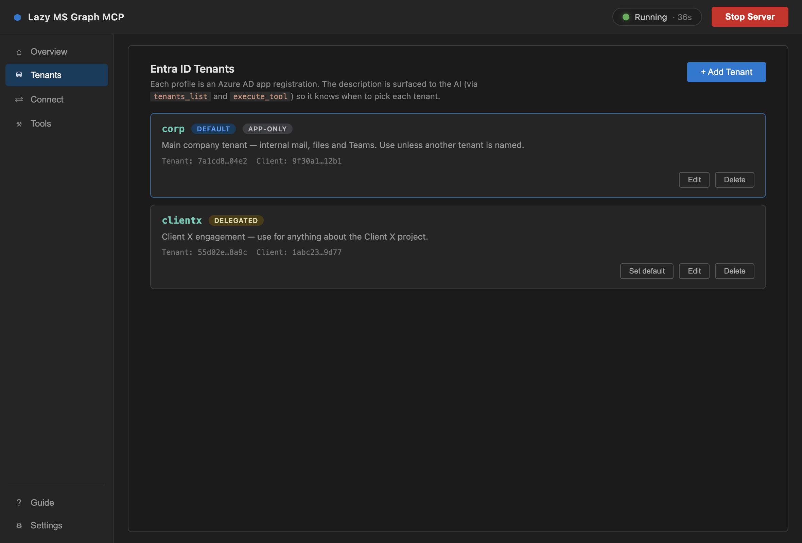

<p align="center">
  
</p>

<h1 align="center">Lazy MS Graph MCP</h1>

<p align="center">
  Access Microsoft 365 — mail, calendar, users, files, teams, and more — directly from Claude, Cursor, or VS Code.
</p>

<p align="center">
  <strong><a href="https://sagarmk.github.io/lazy-mcirosoft-mcp/">sagarmk.github.io/lazy-mcirosoft-mcp</a></strong> — screenshots, use cases, and setup guide
</p>

<p align="center">
  <a href="https://github.com/sagarmk/lazy-mcirosoft-mcp/releases/latest">
    
  </a>
</p>

---

## Quick Start (macOS App)

**[Download the latest DMG](https://github.com/sagarmk/lazy-mcirosoft-mcp/releases/latest)** and drag it to Applications. That's it.

The app gives you:
- One-click server start/stop with live logs
- **Multiple Entra ID tenants** — add several Azure AD app registrations, each with a description that tells the AI when to use it
- Encrypted credential storage
- Auto-install buttons for Claude Code and Cursor (multi-tenant configs included)
- Live, searchable catalog of all 63 tools
- Built-in Azure AD setup guide

<p align="center">
  
</p>

<p align="center">
  
</p>

---

## Quick Start (npm)

If you prefer running the MCP server directly:

### 1. Clone and build

```bash
git clone https://github.com/sagarmk/lazy-mcirosoft-mcp.git
cd lazy-ms-graph-mcp
npm install
npm run build
```

### 2. Set up Azure AD credentials

You need an Azure AD app registration with **Application permissions** (not Delegated). See [Azure Setup](#azure-ad-setup) below.

### 3. Run the server

```bash
MSGRAPH_CLIENT_ID="your-client-id" \
MSGRAPH_CLIENT_SECRET="your-client-secret" \
MSGRAPH_TENANT_ID="your-tenant-id" \
npm start
```

### 4. Add to your IDE

**Claude Code** — add to `~/.claude/claude_desktop_config.json`:

```json
{
  "mcpServers": {
    "lazy-ms-graph": {
      "command": "node",
      "args": ["/path/to/lazy-ms-graph-mcp/packages/server/dist/index.js"],
      "env": {
        "MSGRAPH_CLIENT_ID": "your-client-id",
        "MSGRAPH_CLIENT_SECRET": "your-client-secret",
        "MSGRAPH_TENANT_ID": "your-tenant-id"
      }
    }
  }
}
```

**Cursor** — add to `~/.cursor/mcp.json`:

```json
{
  "mcpServers": {
    "lazy-ms-graph": {
      "command": "node",
      "args": ["/path/to/lazy-ms-graph-mcp/packages/server/dist/index.js"],
      "env": {
        "MSGRAPH_CLIENT_ID": "your-client-id",
        "MSGRAPH_CLIENT_SECRET": "your-client-secret",
        "MSGRAPH_TENANT_ID": "your-tenant-id"
      }
    }
  }
}
```

**VS Code** — add to `.vscode/mcp.json`:

```json
{
  "servers": {
    "lazy-ms-graph": {
      "type": "stdio",
      "command": "node",
      "args": ["/path/to/lazy-ms-graph-mcp/packages/server/dist/index.js"],
      "env": {
        "MSGRAPH_CLIENT_ID": "your-client-id",
        "MSGRAPH_CLIENT_SECRET": "your-client-secret",
        "MSGRAPH_TENANT_ID": "your-tenant-id"
      }
    }
  }
}
```

---

## How It Works

The server exposes **2 MCP tools** to your AI assistant:

1. **`search_tools`** — discover available Microsoft Graph tools by category or keyword
2. **`execute_tool`** — run a tool by name with parameters

Your AI assistant browses by category, picks the right tool, and executes it:

```
You:    "Send an email to john@company.com about the meeting"

AI:     → search_tools({query: "*", category: "mail"})
        ← returns: mail_list_messages, mail_get_message, mail_send_message,
                   mail_reply_message, mail_forward_message, ...

AI:     → execute_tool({tool_name: "mail_send_message", parameters: {
            userId: "me",
            subject: "About the meeting",
            body: "...",
            toRecipients: ["john@company.com"]
          }})
        ← email sent
```

This keeps the MCP surface area small (just 2 tools) while giving access to all 56 operations — important when you have multiple MCP servers loaded.

---

## All Available Tools

56 tools across 11 categories:

| Category | Tools | Operations |
|----------|-------|-----------|
| **users** | 5 | `users_list`, `users_get`, `users_create`, `users_update`, `users_delete` |
| **mail** | 8 | `mail_list_messages`, `mail_get_message`, `mail_send_message`, `mail_reply_message`, `mail_forward_message`, `mail_search_messages`, `mail_list_folders`, `mail_create_folder` |
| **calendar** | 6 | `calendar_list_events`, `calendar_get_event`, `calendar_create_event`, `calendar_update_event`, `calendar_delete_event`, `calendar_find_free_busy` |
| **contacts** | 5 | `contacts_list`, `contacts_get`, `contacts_create`, `contacts_update`, `contacts_delete` |
| **files** | 6 | `files_list`, `files_get`, `files_upload`, `files_download`, `files_search`, `files_share` |
| **teams** | 5 | `teams_list`, `teams_list_channels`, `teams_list_messages`, `teams_send_message`, `teams_get_message` |
| **groups** | 5 | `groups_list`, `groups_get`, `groups_create`, `groups_list_members`, `groups_manage_members` |
| **planner** | 5 | `planner_list_plans`, `planner_get_plan`, `planner_list_tasks`, `planner_create_task`, `planner_update_task` |
| **sharepoint** | 4 | `sharepoint_list_sites`, `sharepoint_get_site`, `sharepoint_list_lists`, `sharepoint_get_list_items` |
| **onenote** | 4 | `onenote_list_notebooks`, `onenote_list_sections`, `onenote_list_pages`, `onenote_get_page_content` |
| **tenants** | 3 | `tenants_list`, `tenants_get_current`, `tenants_switch` |

---

## Multiple Entra ID Tenants

The server can hold several Entra ID (Azure AD) app registrations at once and route each call to the right one. Configure tenants any of these ways (they can be combined; on a name clash the first source wins):

**macOS app** — the **Tenants** page manages profiles visually: add each app registration, give it a description ("when should the AI use this tenant?"), and pick a default. The description is surfaced to the AI through `tenants_list`, and the whole roster is baked into the `execute_tool` schema at startup, so the assistant picks the right tenant on its own.

**Inline JSON** — set `MSGRAPH_TENANTS` to an array (or an object map keyed by name). `description` is optional but strongly recommended — it is what the AI routes on:

```json
[
  { "name": "contoso",  "clientId": "...", "clientSecret": "...", "tenantId": "...",
    "description": "Main company tenant — use unless another tenant is named." },
  { "name": "fabrikam", "clientId": "...", "clientSecret": "...", "tenantId": "...",
    "description": "Fabrikam engagement — use for anything about the Fabrikam project." }
]
```

**JSON file** — set `MSGRAPH_TENANTS_FILE=/path/to/tenants.json` with the same shape.

**Per-tenant environment variables** — one triple per tenant (plus an optional description):

```bash
MSGRAPH_TENANT_CONTOSO_CLIENT_ID="..."
MSGRAPH_TENANT_CONTOSO_CLIENT_SECRET="..."
MSGRAPH_TENANT_CONTOSO_TENANT_ID="..."
MSGRAPH_TENANT_CONTOSO_DESCRIPTION="Main company tenant — use unless another tenant is named."
MSGRAPH_TENANT_FABRIKAM_CLIENT_ID="..."
MSGRAPH_TENANT_FABRIKAM_CLIENT_SECRET="..."
MSGRAPH_TENANT_FABRIKAM_TENANT_ID="..."
```

The classic single-tenant variables (`MSGRAPH_CLIENT_ID` / `MSGRAPH_CLIENT_SECRET` / `MSGRAPH_TENANT_ID`) still work and register a profile named `default`. Tenant names are case-insensitive.

**Picking a tenant at execution time:**

- `execute_tool` accepts an optional top-level `tenant` argument: `{"tool_name": "users_list", "parameters": {}, "tenant": "fabrikam"}`.
- Without it, the **default tenant** is used — the profile named by `MSGRAPH_DEFAULT_TENANT`, else the one named `default`, else the first configured.
- The configured roster — names, default marker, and descriptions — is embedded in the `execute_tool` schema at startup, so the AI knows which tenant fits without an extra lookup.
- The `tenants` tool category manages profiles from the assistant: `tenants_list` shows what is configured (never the secrets), `tenants_get_current` shows the default, and `tenants_switch` changes the default for the session.

---

## Azure AD Setup

### 1. Register an app

1. Go to [portal.azure.com](https://portal.azure.com) > **App registrations** > **New registration**
2. Name it anything (e.g. "Lazy MS Graph MCP")
3. Click **Register**
4. Copy the **Application (client) ID** and **Directory (tenant) ID** from the Overview page

### 2. Create a client secret

1. Go to **Certificates & secrets** > **New client secret**
2. Copy the **Value** immediately (shown only once)

### 3. Add Application permissions

> **IMPORTANT**: You must add **Application** permissions, not **Delegated** permissions. Delegated permissions will not work and all API calls will return 403 errors.

1. Go to **API permissions** > **Add a permission** > **Microsoft Graph** > **Application permissions**
2. Add the permissions you need:
   - `User.Read.All` — for user tools
   - `Mail.Read`, `Mail.Send` — for mail tools
   - `Calendars.ReadWrite` — for calendar tools
   - `Files.ReadWrite.All` — for file tools
   - `Team.ReadBasic.All` — for teams tools
3. Click **Grant admin consent**

---

## Environment Variables

| Variable | Fallback | Required |
|----------|----------|----------|
| `MSGRAPH_CLIENT_ID` | `MICROSOFT_MCP_CLIENT_ID` | Yes* |
| `MSGRAPH_CLIENT_SECRET` | `MICROSOFT_MCP_CLIENT_SECRET` | Yes* |
| `MSGRAPH_TENANT_ID` | `MICROSOFT_MCP_TENANT_ID` | Yes* |
| `MSGRAPH_TENANTS` | — | No (inline JSON list of tenants) |
| `MSGRAPH_TENANTS_FILE` | — | No (path to a tenants JSON file) |
| `MSGRAPH_TENANT_<NAME>_CLIENT_ID` / `_CLIENT_SECRET` / `_TENANT_ID` | — | No (per-tenant triples) |
| `MSGRAPH_TENANT_<NAME>_DESCRIPTION` | — | No (tells the AI when to use that tenant) |
| `MSGRAPH_DEFAULT_TENANT` | — | No (tenant profile used when a call names none) |
| `MSGRAPH_MCP_PORT` | `MICROSOFT_MCP_PORT` | No (default: 3100) |
| `MSGRAPH_MCP_TRANSPORT` | `MICROSOFT_MCP_TRANSPORT` | No (default: stdio) |

\* Required only when no tenants are configured through `MSGRAPH_TENANTS`, `MSGRAPH_TENANTS_FILE`, or `MSGRAPH_TENANT_<NAME>_*` variables. See [Multiple Entra ID Tenants](#multiple-entra-id-tenants).

---

## License

MIT
